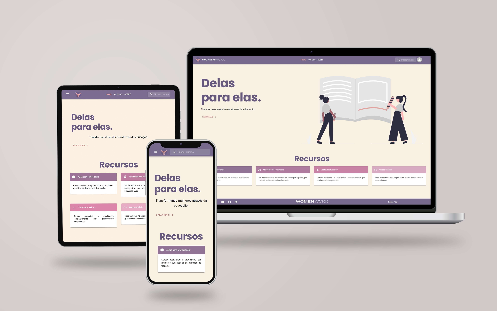

   

 

   
   
   
   
   

 

[**Sobre**](#-sobre) &nbsp;&nbsp;**|**&nbsp;&nbsp;
[**Features**](#-features) &nbsp;&nbsp;**|**&nbsp;&nbsp;
[**Tecnologias e ferramentas utilizadas**](#-tecnologias-e-ferramentas-utilizadas) &nbsp;&nbsp;**|**&nbsp;&nbsp;
[**Layout**](#-layout) &nbsp;&nbsp;**|**&nbsp;&nbsp;
[**Deploy**](#-deploy) &nbsp;&nbsp;**|**&nbsp;&nbsp;
[**Colaboradores**](#-colaboradores)

## 📃 Sobre

<!---->

**WomenWork** é um projeto desenvolvido durante o Bootcamp JavaScript FullStack da Generation Brasil. 

O projeto, um e-commerce pautado na [ODS 5 da ONU](https://brasil.un.org/pt-br/sdgs/5), voltado a oferecer cursos de tecnologia com preços acessíveis para mulheres em situação de vulnerabilidade social.

## ✨ Features

### Back-end

- [x] Criação de usuários, cursos e categorias
- [x] Consulta de usuários, cursos e categorias
- [x] Atualização de usuários, cursos e categorias
- [x] Remoção de cursos e categorias

<!---->

### Front-end
- [x] Criação de conta e login
- [x] Cadastro, atualização e exibição de cursos
- [x] Compra de cursos e listagem de cursos comprados
- [x] Barra de pesquisa
- [x] Alteração de imagem de perfil do usuário (upload e remoção)

## 🔧 Tecnologias e ferramentas utilizadas

<table>
  <tbody>
    <tr>
      <td style="font-weight: bold">Back-end</td>
      <td>
        <a href="https://www.typescriptlang.org/" target="_blank" rel="noopener noreferrer">Typescript</a>,
        <a href="https://nodejs.org/en/" target="_blank" rel="noopener noreferrer">NodeJs</a>,
        <a href="https://www.nestjs.com/" target="_blank" rel="noopener noreferrer">NestJS</a>,
        <a href="https://www.mysql.com" target="_blank" rel="noopener noreferrer">MySQL</a>,
        <a href="https://www.insomnia.rest" target="_blank" rel="noopener noreferrer">Insomnia</a>
      </td>
    </tr>
    <tr>
      <td style="font-weight: bold">Front-end</td>
      <td>
        <a href="https://www.typescriptlang.org/" target="_blank" rel="noopener noreferrer">TypeScript</a>,
        <a href="https://reactjs.org/" target="_blank" rel="noopener noreferrer">React</a>,
        <a href="https://mui.com/" target="_blank" rel="noopener noreferrer">MaterialUI</a>,
        <a href="https://redux.js.org/" target="_blank" rel="noopener noreferrer">Redux</a>,
        <a href="https://axios-http.com/docs/intro" target="_blank" rel="noopener noreferrer">Axios</a>
      </td>
    </tr>
  </tbody>
</table>

## 📟 Layout

## 🚀 Deploy

<table>
  <tbody>
    <tr>
      <td style="font-weight: bold">API (SwaggerUI)</td>
      <td>http://womenwork.onrender.com/</td>
    </tr>
    <tr>
      <td style="font-weight: bold">Front-end</td>
      <td>https://womenwork.vercel.app/</td>
    </tr>
  </tbody>
</table>

## 🤝 Colaboradores

  

A equipe **WomenWork** é composta pelas seguintes pessoas:

 
<table>

<tr>

<td align="center">

<a href="#">

 

<b>Rafaele Souza</b>

</a>
</a>

</td>

<td align="center">

<a href="#">

 

<b>João V. Estevam</b>

</a>
</a>

</td>
<td align="center">

<a href="#">

 

<b>Henrique Oliveira</b>

</a>
</a>

</td>
<td align="center">

<a href="#">

 

<b>Júlio Cesar</b>

</a>
</a>

</td>
<td align="center">

<a href="#">

 

<b>Victor França</b>

</a>
</a>

</td>
<td align="center">

<a href="#">

 

<b>Carlos Eduardo</b>

</a>
</a>

</td>
</tr>

</table>

---

<h5 align="center">
  &copy;2022 - <a href="https://github.com/Women-Work/">WomenWork</a>
</h5>
